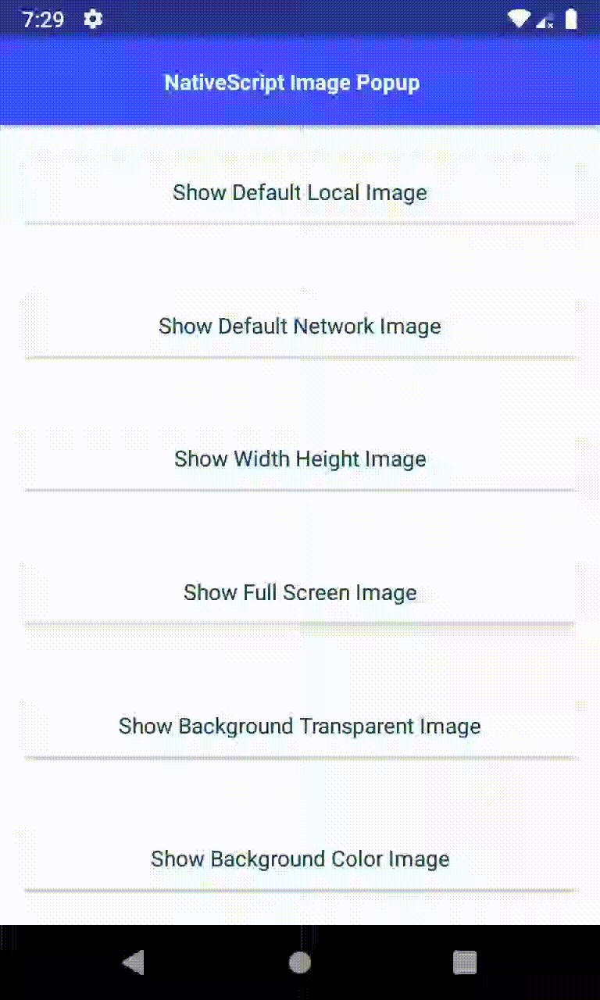

Image Popup plugin for NativeScript.

Based on:

- Android [chathuralakmal/AndroidImagePopup](https://github.com/chathuralakmal/AndroidImagePopup)
- iOS - Coming Soon.

# Install

### NativeScript 6x

```bash
tns plugin add nativescript-image-popup
```




# Android Specifications

#### Usage Examples


```js
import { ImagePopup } from 'nativescript-image-popup';
import { ImagePopupOptions } from 'nativescript-image-popup/classes';

// basic use
ImagePopup.localImagePopup("~/assets/images/nmb.jpg");

// or

ImagePopup.networkImagePopup("https://i.hizliresim.com/kx47Db.png");


// with options
const options: ImagePopupOptions = {
    path: "https://i.hizliresim.com/kx47Db.png",
    width: 500,
    height: 500,
    fullScreen: true,
    backgroundColor:ImagePopupBackgroundColors.TRANSPARENT, // or manuel color ( red, blue #ffd200)
    hideCloseIcon: false;
    imageOnClickClose: true
};

```

#### NativeScript Image Popup - Methods

- `localImagePopup(options: ImagePopupOptions | string)`
- `networkImagePopup(options: ImagePopupOptions | string)`


## Why the TNS prefixed name?

`TNS` stands for **T**elerik **N**ative**S**cript

iOS uses classes prefixed with `NS` (stemming from the [NeXTSTEP](https://en.wikipedia.org/wiki/NeXTSTEP) days of old):
https://developer.apple.com/library/mac/documentation/Cocoa/Reference/Foundation/Classes/NSString_Class/

To avoid confusion with iOS native classes, `TNS` is used instead.

## Demo

Need extra help getting these Image Popup working in your application? Check out these tutorials that make use of the plugin:

[Image Popup in a NativeScript Core Demo](https://github.com/NazimMertBilgi/nativescript-image-popup/blob/master/demo/app/home/home-page.ts)

[Image Popup in a NativeScript Angular Demo](https://github.com/NazimMertBilgi/nativescript-image-popup/blob/master/demo-angular/src/app/home/home.component.ts)

## License

MIT